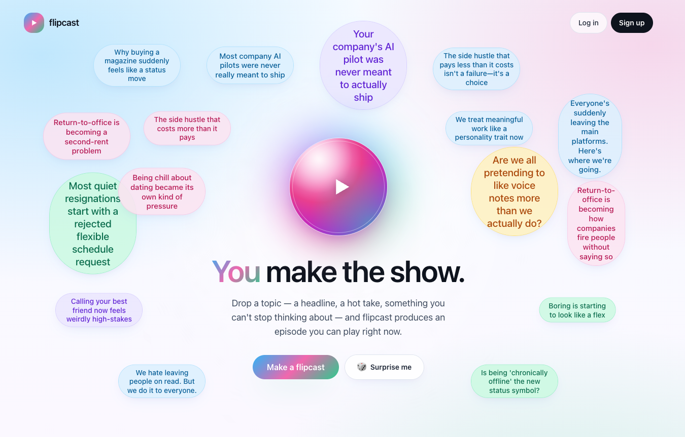
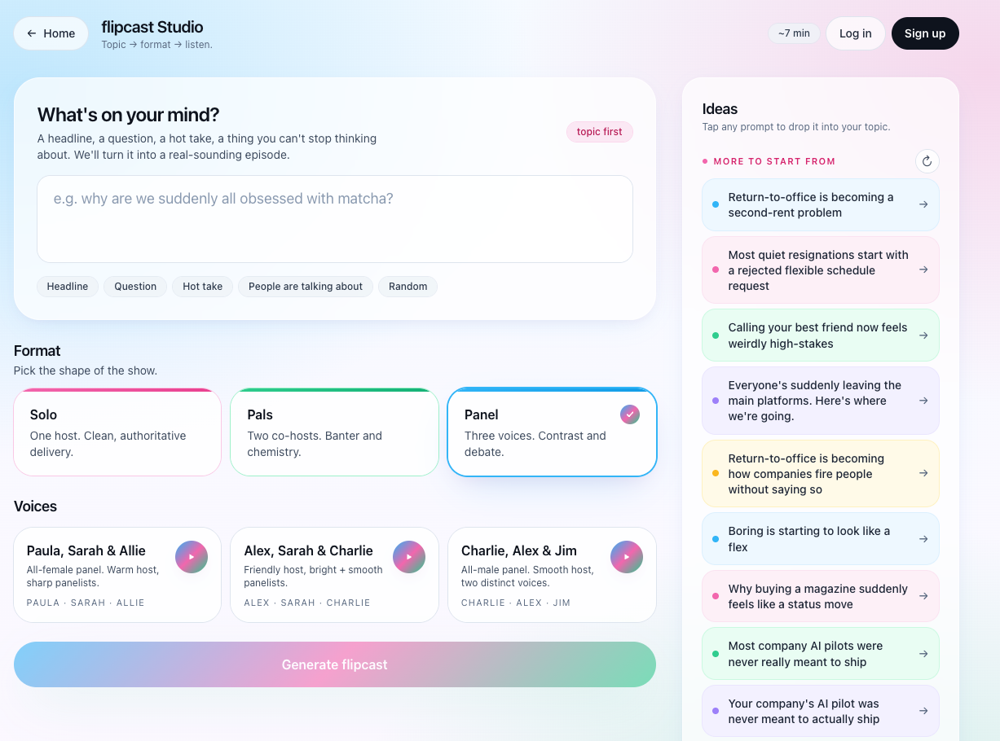
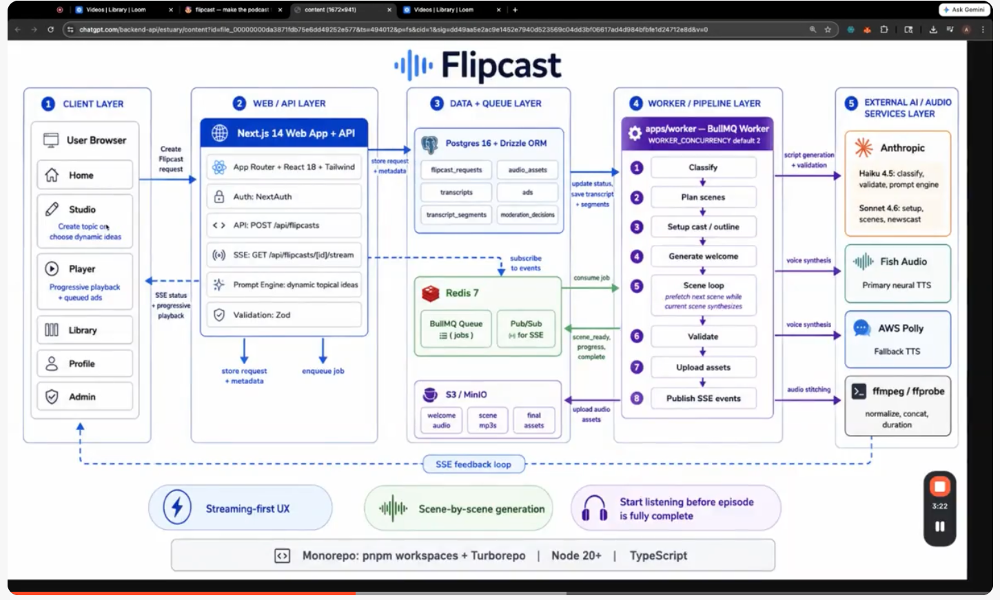

# Flipcast

Flipcast is a personalized, on-demand audio show generator. A listener submits a topic, and Flipcast produces a short podcast-style episode with a station intro, generated host or panel dialogue, interleaved ad breaks, live progress updates, and playable MP3 assets.







The project is a TypeScript monorepo with a Next.js web app, a BullMQ worker, shared domain packages, Postgres, Redis, and S3-compatible object storage.

## What it does

- Turns a topic prompt into a structured audio episode.
- Supports generated show formats such as panel discussions and news-style casts.
- Streams generation progress to the browser with Server-Sent Events.
- Stores request state, transcripts, segments, and generated audio metadata in Postgres.
- Writes generated audio to MinIO locally, using an S3-compatible client.
- Uses Anthropic for topic and script generation.
- Uses Fish Audio for current live TTS generation, with legacy Polly/ElevenLabs tooling still present for static assets and older workflows.

## Repository layout

```text
.
+-- apps/
|   +-- web/              Next.js app, UI, auth, API routes, SSE endpoint
|   +-- worker/           BullMQ worker and audio generation pipeline
+-- packages/
|   +-- types/            Shared schemas, voice catalog, policy, playback types
|   +-- server-db/        Drizzle schema and Postgres client
|   +-- queue/            BullMQ queue helpers and Redis pub/sub
+-- docs/
|   +-- present-state/    Architecture, operations notes, roadmap, handoff docs
+-- docker-compose.yml    Local app stack
+-- package.json          Root workspace scripts
+-- pnpm-workspace.yaml
+-- turbo.json
+-- tsconfig.base.json
```

## Requirements

- Node.js 20+
- pnpm 9.12.0+
- Docker and Docker Compose
- API keys for real generation:
  - `ANTHROPIC_API_KEY`
  - `FISH_AUDIO`

## Quick start

Create your local env file:

```bash
cp .env.example .env
```

Edit `.env` and add at least:

```bash
ANTHROPIC_API_KEY=...
FISH_AUDIO=...
AUTH_SECRET=...
```

For local auth, generate `AUTH_SECRET` with:

```bash
node -e "console.log(require('crypto').randomBytes(32).toString('base64'))"
```

Start the full local stack:

```bash
docker compose up -d --build
```

Then open:

- Web app: http://localhost:3000
- MinIO console: http://localhost:9001

Default MinIO credentials are `minioadmin` / `minioadmin` unless changed in `.env`.

## Development commands

From the repo root:

```bash
pnpm install
pnpm dev
pnpm build
pnpm typecheck
pnpm lint
```

Database helpers:

```bash
pnpm db:generate
pnpm db:migrate
pnpm db:push
```

When using Docker Compose, apply schema changes with:

```bash
docker compose run --rm --build migrate
```

Reload `.env` changes into already-running app containers:

```bash
docker compose up -d --force-recreate web worker
```

`docker compose restart` is not enough for env changes because it keeps the old container environment.

## Services

The local Docker stack includes:

| Service | Purpose | Default port |
| --- | --- | --- |
| `postgres` | Primary database | `5432` |
| `redis` | BullMQ broker and SSE pub/sub | `6379` |
| `minio` | S3-compatible audio storage | `9000` |
| `minio` console | Storage admin UI | `9001` |
| `migrate` | One-shot Drizzle schema push | - |
| `web` | Next.js app | `3000` |
| `worker` | Audio generation worker | - |

## Environment variables

Most local defaults live in `.env.example`. The most important variables are:

| Variable | Purpose |
| --- | --- |
| `ANTHROPIC_API_KEY` | Enables real topic/script generation |
| `FISH_AUDIO` | Enables current live TTS synthesis |
| `FLIPCAST_DEFAULT_ENGINE` | Current default is `fish` |
| `FLIPCAST_DEFAULT_SPEED` | Default speech speed, clamped from `0.7` to `1.2` |
| `DATABASE_URL` | Injected by Compose for app containers |
| `REDIS_URL` | Injected by Compose for app containers |
| `S3_PUBLIC_ENDPOINT` | Browser-visible base URL for generated audio |
| `AUTH_SECRET` | NextAuth secret |
| `GOOGLE_CLIENT_ID` / `GOOGLE_CLIENT_SECRET` | Optional Google OAuth credentials |

## Useful worker scripts

These run inside the worker package and write static assets into `apps/web/public`:

```bash
docker compose exec worker pnpm ads
docker compose exec worker pnpm intro
docker compose exec worker pnpm voice-samples
docker compose exec worker pnpm pad-ads
docker compose exec worker pnpm seed-ads
```

## Documentation

Start with the present-state docs for deeper project context:

- [Architecture](docs/present-state/architecture.md)
- [Playback pipeline](docs/present-state/playback-pipeline.md)
- [Operations](docs/present-state/operations.md)
- [Roadmap](docs/present-state/roadmap.md)

Older planning documents are kept under `docs/flabbercast_plan/` and `docs/medium_flow/`. The product name is now Flipcast.
